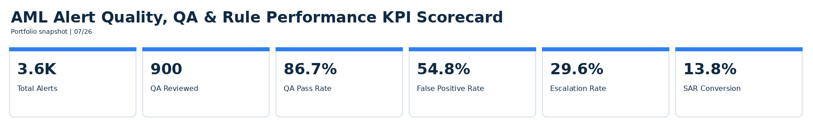
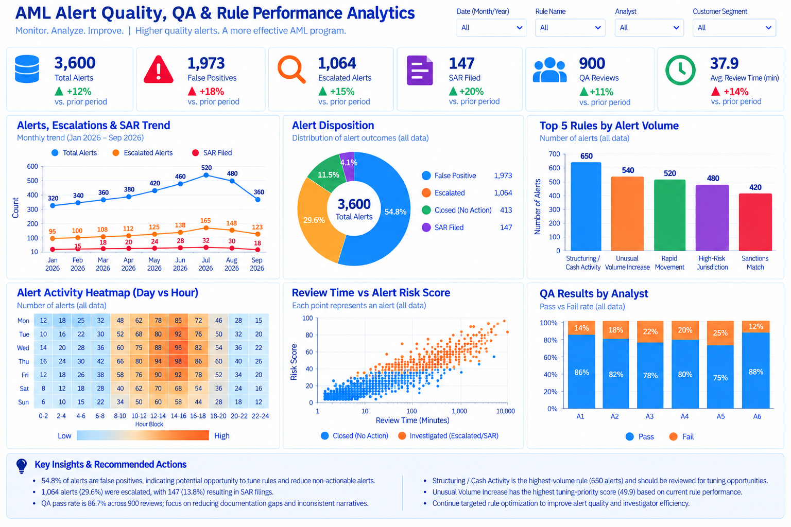
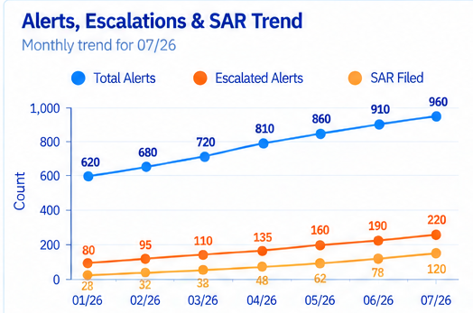
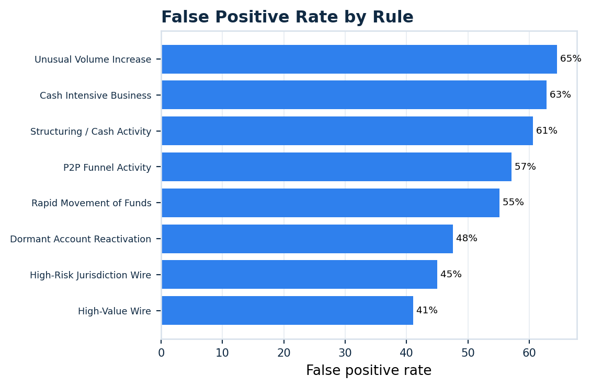
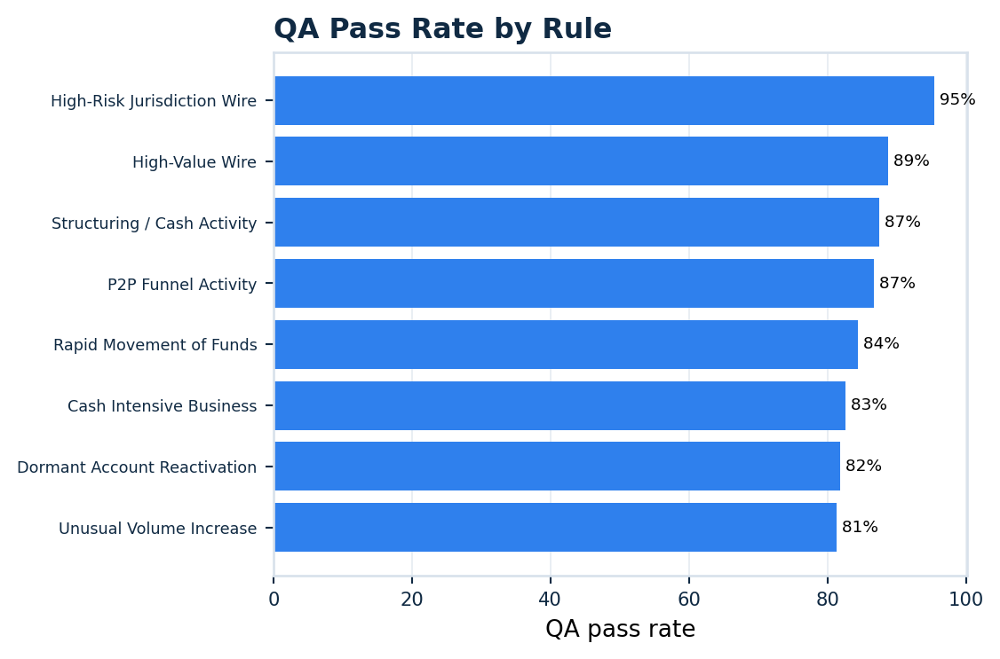

# AML Alert Quality, QA & Rule Performance Analytics

Project 6 in the Financial Crime Analytics portfolio.

This project is designed to complement the earlier portfolio rather than repeat transaction-monitoring investigations. Instead of asking **“Is this individual alert suspicious?”**, Project 6 asks **“How well are our AML alerts, review process, and monitoring rules performing?”**

## Scale
- 3,600 synthetic AML alerts
- 8 transaction-monitoring rules
- 900 QA reviews
- 12 synthetic analysts

## Core Analytics
- Alert volume
- False-positive rate
- Escalation rate
- SAR conversion
- QA pass/fail rate
- QA defect categories
- Alert aging
- Review time
- Rule review priority

## Tools
SQL, Python, Tableau, Streamlit.

## Separate KPI Visualization
1. Total Alerts
2. QA Reviewed
3. QA Pass Rate
4. False Positive Rate
5. Escalation Rate
6. SAR Conversion

## Executive Dashboard
Exactly six analytical visualizations:
1. Alert, Escalation & SAR Trend
2. False Positive Rate by Rule
3. QA Pass Rate by Rule
4. Alert Aging Heatmap with values inside cells
5. Alert Volume vs Escalation Rate scatter
6. Rule Review Priority Score

The dashboard uses one visualization color only: blue. Dates use MM/YY such as 07/26.

## Dashboard Preview

The visuals below provide a quick view of the project's key AML alert-quality, QA, and rule-performance findings.

### KPI Scorecard

The KPI scorecard summarizes the core operating measures used throughout the project: Total Alerts, QA Reviewed, QA Pass Rate, False Positive Rate, Escalation Rate, and SAR Conversion.

### Executive Dashboard

The executive dashboard brings together alert trends, rule efficiency, QA quality, alert aging, escalation behavior, and rule-review priorities in one view.

### Featured Dashboard Visual 1 — Alert, Escalation & SAR Trend

Shows how alert volume, escalations, and SAR-related outcomes change over time, making it easier to identify shifts in transaction-monitoring activity and downstream investigative workload.

### Featured Dashboard Visual 2 — False Positive Rate by Rule

Compares false-positive performance across transaction-monitoring rules to identify scenarios generating a larger share of non-actionable alerts.

### Featured Dashboard Visual 3 — QA Pass Rate by Rule

Compares QA performance across monitoring rules to highlight areas where investigation quality, documentation, or disposition consistency may require closer review.

## Disclaimer
All data is synthetic. The rule-review priority score is an educational analytics framework and does not represent production AML model tuning or regulatory model validation.

