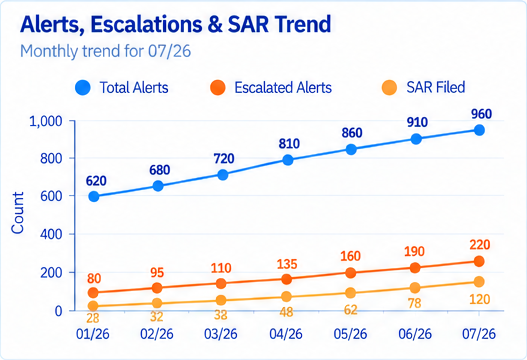
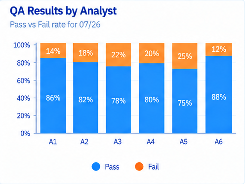

# AML Alert Quality, QA & Rule Performance Analytics

Project 6 in the Financial Crime Analytics portfolio.

This project is designed to complement the earlier portfolio rather than repeat transaction-monitoring investigations. Instead of asking **“Is this individual alert suspicious?”**, Project 6 asks **“How well are our AML alerts, review process, and monitoring rules performing?”**

## Scale
- 3,600 synthetic AML alerts
- 8 transaction-monitoring rules
- 900 QA reviews
- 12 synthetic analysts

## Core Analytics
- Alert volume
- False-positive rate
- Escalation rate
- SAR conversion
- QA pass/fail rate
- QA defect categories
- Alert aging
- Review time
- Rule review priority

## Tools
SQL, Python, Tableau, Streamlit.

## Separate KPI Visualization
1. Total Alerts
2. QA Reviewed
3. QA Pass Rate
4. False Positive Rate
5. Escalation Rate
6. SAR Conversion

## Executive Dashboard
Exactly six analytical visualizations:
1. Alert, Escalation & SAR Trend
2. False Positive Rate by Rule
3. QA Pass Rate by Rule
4. Alert Aging Heatmap with values inside cells
5. Alert Volume vs Escalation Rate scatter
6. Rule Review Priority Score

The dashboard uses one visualization color only: blue. Dates use MM/YY such as 07/26.

## Dashboard Preview

The four visuals below come directly from the approved executive dashboard and give a quick view of the project's AML alert-quality, operational, and QA findings.

### KPI Scorecard

**What it represents:** The KPI scorecard provides an at-a-glance view of the AML monitoring program's workload, alert quality, investigation outcomes, QA coverage, and review efficiency. Total Alerts measures monitoring volume; False Positives shows how many alerts did not result in actionable concerns; Escalated Alerts and SAR Filed show how alerts progress into higher-risk investigative outcomes; QA Reviews measures quality-control coverage; and Average Review Time indicates analyst effort and operational efficiency.

### Executive Dashboard

**What it represents:** The executive dashboard brings the major AML monitoring and QA indicators into one management view. It shows how alert volumes and outcomes change over time, how alerts are ultimately dispositioned, which monitoring rules generate the most alerts, when alert activity is concentrated, how review time relates to alert risk, and how QA results vary across analysts. Together, these views help identify operational pressure, rule-performance issues, investigation patterns, and potential areas for quality improvement.

### Alerts, Escalations & SAR Trend

**What it represents:** This trend compares monthly Total Alerts, Escalated Alerts, and SAR Filed outcomes. It helps show whether increases in monitoring volume are also producing more escalations and SAR filings. A widening or narrowing gap between the three measures can help analysts assess how alert growth is translating into downstream investigative activity and higher-risk outcomes.

### QA Results by Analyst

**What it represents:** This 100% stacked bar chart compares QA Pass and Fail percentages across analysts. It highlights differences in investigation and documentation quality and makes it easier to identify analysts with stronger or weaker QA outcomes. The view can support targeted coaching, consistency reviews, and additional quality-control attention where failure rates are comparatively high.

## Resume Bullets
**AML Alert Quality, QA & Rule Performance Analytics | SQL, Python, Tableau, Streamlit**
- Analyzed 3,600 synthetic AML alerts across 8 monitoring rules to measure alert volume, false-positive rates, escalation rates, SAR conversion, alert aging, and operational performance.
- Built QA and rule-performance reporting using SQL and Python, then developed Tableau and Streamlit views to identify QA defects, compare rule effectiveness, and prioritize monitoring scenarios for analyst review.

## Interview Explanation
“I built this project to analyze the quality and performance of AML monitoring rules rather than investigate one alert at a time. I measured alert volume, false-positive rate, escalation rate, SAR conversion, QA pass rate, aging, and review effort. I then created an explainable rule-review priority score to identify scenarios that may deserve threshold or logic review. The project stays at the analyst level: it recommends where to investigate performance issues, but it does not claim production rule tuning or model validation.”

## Disclaimer
All data is synthetic. The rule-review priority score is an educational analytics framework and does not represent production AML model tuning or regulatory model validation.

## Approved Blue & Orange Dashboard
The final Project 6 dashboard uses only blue and orange for analytical marks, with navy text on a white background. It contains six KPI cards and exactly six analytical visualizations. The QA Results by Analyst visualization is a stacked Pass/Fail bar chart.

The packaged `images/02_executive_dashboard.png` is the approved final dashboard reference.
